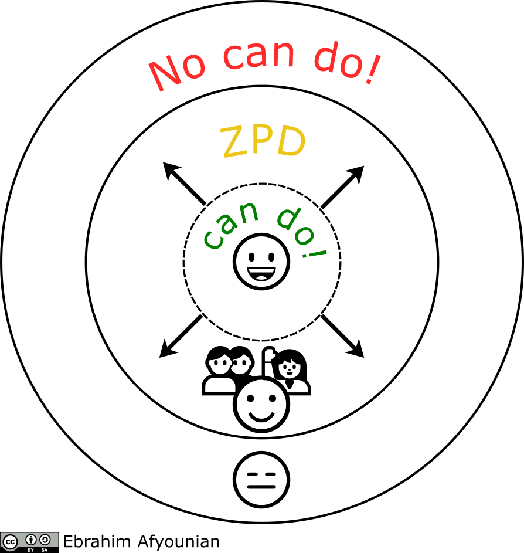
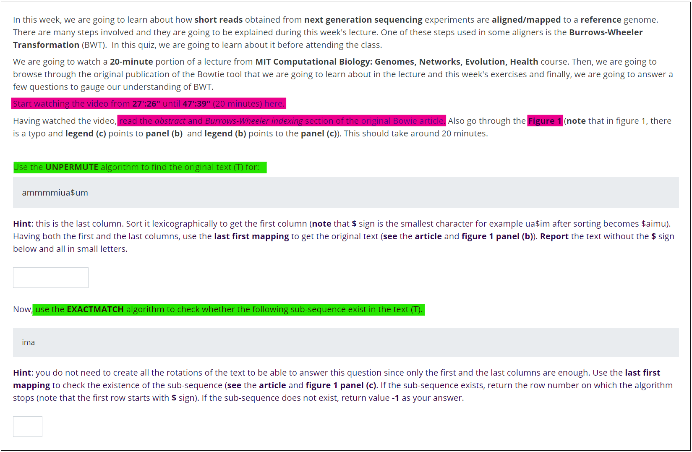
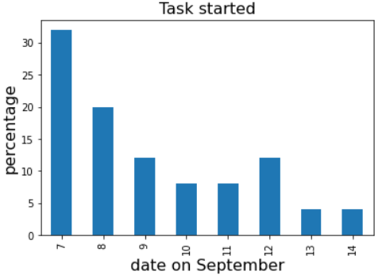
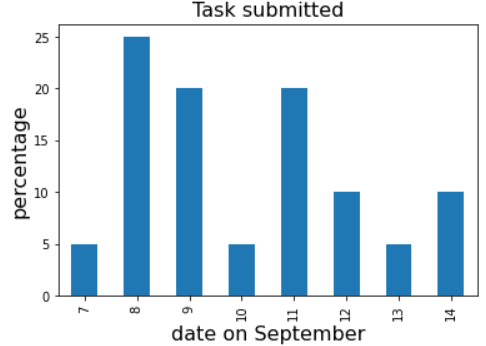
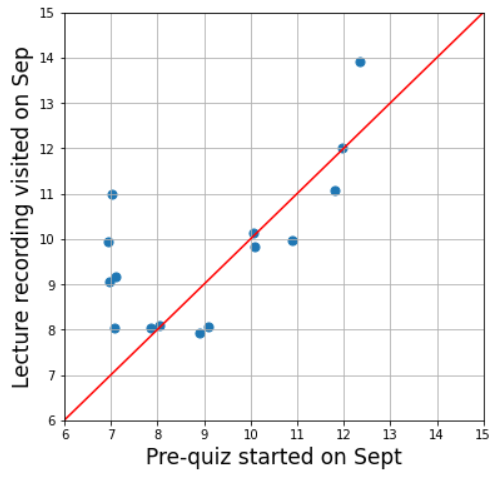
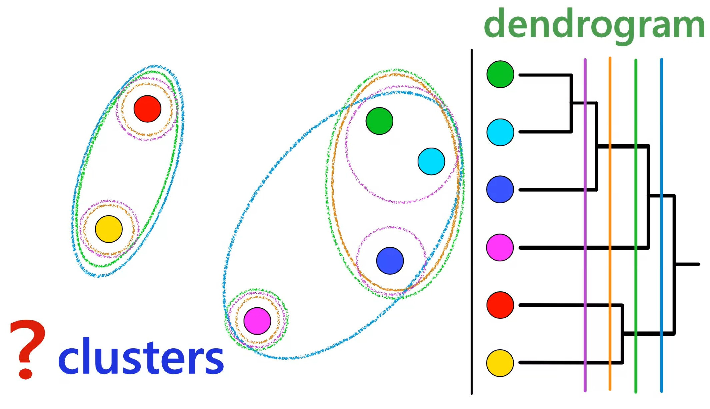
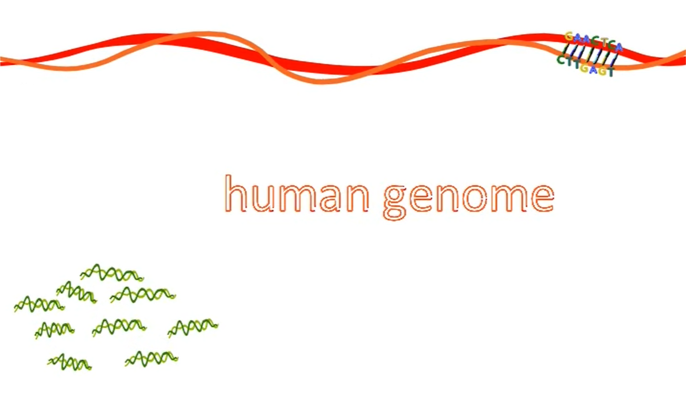
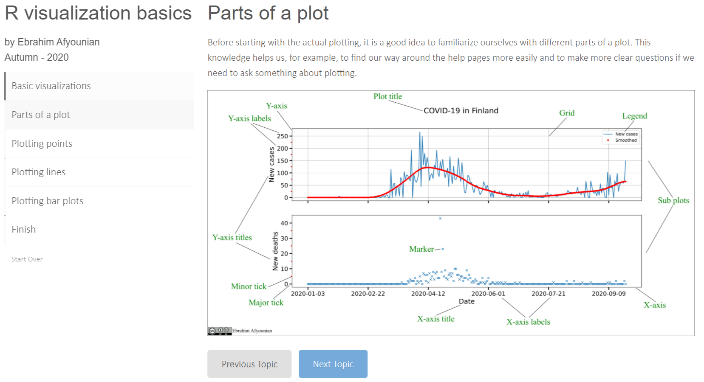
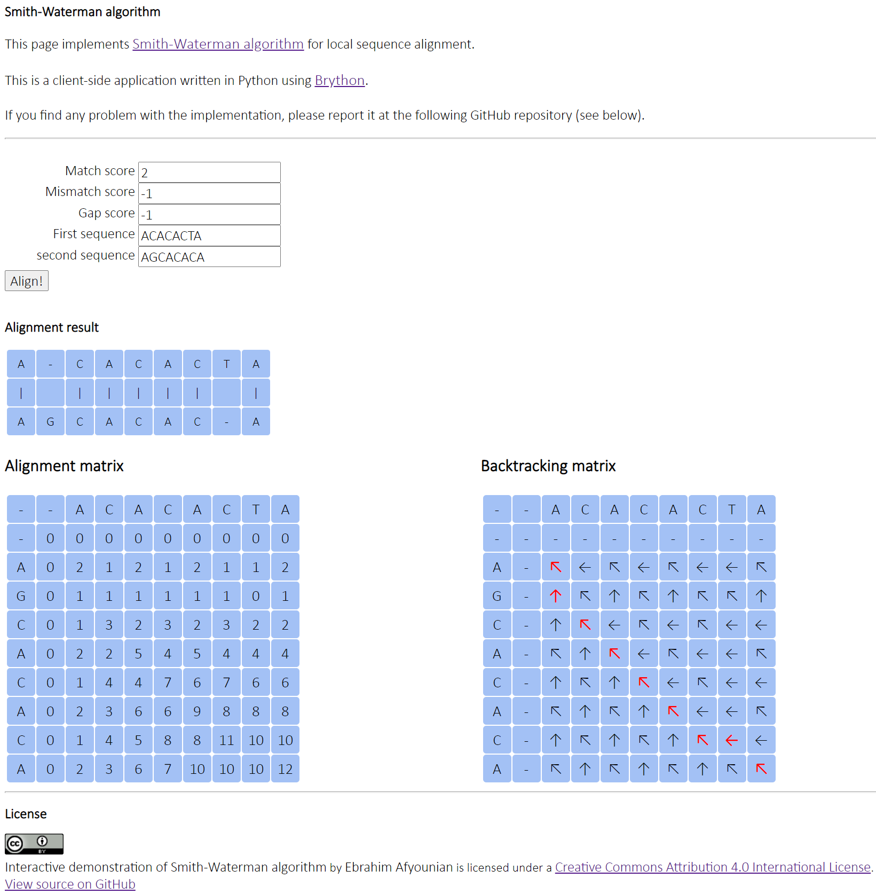

layout: true

    

---
.centre[

# &#x2660; Digital pedagogy pilot project &#x2660;

## digi-pilot / digipilotti

### Ebrahim Afyounian  

#### Tampere - 28-09-2020

## &#x1F342;

]
---

## Project logistics

- 1-year project
- 6 digi-pilot projects in Tampere University
- Bioinformatics digi-pilot (started on March 2020)
- Head of the project:
  - Juha K.  (MET)
  - Anne K. (MET)
- Kaisa L. (March-September 2020)
- Ebrahim A. (July-December 2020)

---

## Digi-pilot general aims

### &#x1F50D; lifelong learning
  
- Enabling distant learning for working-life students
- Improving course quality
- Providing versatile teaching materials
- Allocating the resources where they are the most beneficial

???

- Perspective/viewpoint is lifelong learning

---

## Bioinformatics digi-pilot aims

- Developing bioinformatics teaching resources
  - Employing pedagogically-informed teaching methods
  - Exercises that stay relevant for many years
- Developing students' know-how
- Making the schedule more flexible for the students
- Supporting and enhancing teachers' work
- Providing immediate feedback for both students and teachers

---

## Focus

### Focus is on 3 master's level courses* (each 5 ECTS)

- **BTK6002**: Introduction to high-throughput data analysis [period **I**]
- **BTK6003**: Biological data analysis [period **II**]
- **BTK6004**: High-throughput sequencing data analysis [periods **III** and **IV**]
   
\* Master's Degree Programme in Biomedical Technology  

---

## Pedagogical considerations (1)

### Constructive alignment

- &#x26A1; **Idea in brief**: To get the most out of the teaching and learning, we have to **align** *intended learning outcomes*, the *teaching activities*, and *the assessment*
- **Constructive** part comes from  *constructivist theories* that argues **the student and her activities** have the **central role** in **creating meaning**
- Quizzes and exercises are designed to
  - be aligned with the **learning outcomes** and **teaching activities** (i.e. lectures and tutorials)
  - increase student's performance in reaching higher levels of complexity (e.g. at least level 3 and 4 in **SOLO taxonomy**)
- **example**: variant calling exercise set (BTK6002, week 4)
  - Prepare data, call variants, annotate, inspect, filter, select, contextualize...
- **Capstone project** is designed to assess students' performance at all 5 levels of the SOLO taxonomy

 

.smaller-font[
**See** e.g. [Enhancing teaching through constructive alignment](https://doi.org/10.1007/BF00138871) (Biggs, 2006)
]

???

- **constructivism**:
  - learning: knowledge is constructed by the students
  - teaching: guiding to solve problems
- **behaviorism**:
  - learning: expected response. 2x2=4
  - teaching: condition students by repetition
- **cognitivism**:
  - learning: recalling information. Capital of Finland is Hel
  - teaching: help in storing and processing knowledge
- **SOLO**: the Structure of the Observed Learning Outcome
  - levels: pre-structural, unistructural, multi-structural, Relational, Extend abstract
  - I: failure and incompetence (no can do!)
  - II: follow simple instructions, identify, name (run bowti2)
  - III: Combine things that are relevant, describe, list (run bowtie2, samtools sort)
  - IV: relation of things together, Analyze, apply, compare, relate (inspect and understand results for above)
  - V: Create, generate, generalize to a new domain (Use all these to analyze new data set, new data type)

---

## Pedagogical considerations (2)

### **Threshold concepts first** approach vs. maximum coverage

- **Fundamental concepts** of a discipline, learning and understanding of which provides entry to that discipline
  - &#x1F511; &#x1F6AA; to Dante's Paradise &#x1F308;
  - If not learned, students are stuck at a **liminal state** (imagine being stuck at Dante's Purgatory &#x1F311;)
- More troublesome to learn compared to other concepts e.g. *core concepts*
  - Gene expression regulation pathway vs. transcription factor
- Results in changes in perspective and possibly behavior

.quote-box[
>*Nothing in biology makes sense except in the light of **evolution***.
>  
>**Theodosius Dobzhansky** (`1900-1975`)
]

.smaller-font[  
**See** e.g. &#x1F4DA; [Teaching For Quality Learning At University](https://isbndb.com/book/9780335242757) and [University Teaching In Focus](https://isbndb.com/book/9780415644068)
]

???

- less frustration, lower failure rate, better student engagement

---

## Pedagogical considerations (3)

### Zones of proximal development (ZPD) and scaffolding  

.right-column[

]

.leftt-column[

- **ZPD** is the zone in which student can do things **with assistance** &#x1F64B; &#x1F465;
- **Scaffolding** is whatever activities that can provide such assistance
  - Tutorials, animations, exercises, exercise sessions
  - A complex task (e.g. variant calling) is broken down into less complex tasks with step-by-step instructions to advance
  - Each step builds on an earlier step

]
    
.smaller-font[  
**See** &#x1F4DA; [Mind in Society](https://isbndb.com/book/9780674076693) (Vygotsky, 1978) and [University Teaching In Focus](https://isbndb.com/book/9780415644068)
]

???

- Different zones of student ability
- Same as scaffolds helping a construction worker to reach unreachable floors with his height

---

## Pedagogical considerations (4)

### Flipped classroom (1)

- An **alternative** to the **traditional lecture**
- **Before the session**, students engage in preliminary learning of a particular topic/concept
  - Watching a short **video** and/or reading parts of a **book**, an **article** or an **encyclopedia entry**
  - **Perform a few tasks/exercises to gauge their understanding**
- **During the session**, the freed time is used to answer/discuss difficulties in understanding encountered by the students before the session
- In essence, it emphasizes a type of **student-centered learning** as opposed by teacher-centered learning
- Additionally, it can be considered as a form of **active learning** as opposed to passive learning 
  - **see**. e.g. [Jensen et al, 2017](https://doi.org/10.1187/cbe.14-08-0129)
- a.k.a. *reverse teaching* (**see** e.g. &#x1F4DA; [The Flipped Classroom](https://isbndb.com/book/9789811034138))

---

## Pedagogical considerations (4)

### Flipped classroom (2)

- We have used some **elements** of flipped classroom methodology in the **BTK6002** course
- Going to use this in **BTK6003** as well.

.center[

]

???

- Students are required to do the task before the session
- For example watch a video on Burrows Wheeler Transform (BWT)

---

## Pedagogical considerations (4)

### Flipped classroom (3)

- Exercise was expected to be viewed and completed before **08.09.2020** - 10 a.m.
  - Only **15 students** have watched the video (data accessed on 23.09.2020-13:00)
  - **All** have viewed the lecture slides.
- According to [Compeau (2019)](https://journals.plos.org/ploscompbiol/article?id=10.1371/journal.pcbi.1006764), the flipped classroom method and its benefits of using it should be discussed with students beforehand for an implementation to be successful.  

.center[

]

???

- Difficult to enforce in the current setup
- We did not push it
- 14th was the deadline for the exercise set

---

count: false

## Pedagogical considerations (4)

### Flipped classroom (3)

- Exercise was expected to be viewed and completed before **08.09.2020** - 10 a.m.
  - Only **15 students** have watched the video (data accessed on 23.09.2020-13:00)
  - **All** have viewed the lecture slides.
- According to [Compeau (2019)](https://journals.plos.org/ploscompbiol/article?id=10.1371/journal.pcbi.1006764), the flipped classroom method and its benefits of using it should be discussed with students beforehand for an implementation to be successful.  

.center[

]

???

- Difficult to enforce in the current setup
- We did not push it
- 14th was the deadline for the exercise set
---

count: false

## Pedagogical considerations (4)

### Flipped classroom (3)

- Exercise was expected to be viewed and completed before **08.09.2020** - 10 a.m.
  - Only **15 students** have watched the video (data accessed on 23.09.2020-13:00)
  - **All** have viewed the lecture slides.
- According to [Compeau (2019)](https://journals.plos.org/ploscompbiol/article?id=10.1371/journal.pcbi.1006764), the flipped classroom method and its benefits of using it should be discussed with students beforehand for an implementation to be successful.  

.center[

]

???

- Difficult to enforce in the current setup
- We did not push it
- 14th was the deadline for the exercise set

---

## Environment

- Binf remote server *binf.rd.tuni.fi*
  - Unix command-line
  - [RStudio Pro (Academic License)](https://rstudio.com/pricing/academic-pricing/) and [*learnr*](https://rstudio.github.io/learnr/) (**special** thanks to **Tomi H.** &#x1F451;)
- Moodle **Quiz** and **H5P** modules
  - Ability **to grade exercises** and **to give instant feedback**
  - Analyze course activity to find areas requiring development
- **Panopto** screen capture and video publishing software (for recording **lectures**)
- Digital signature service (TUNI Sign &#x1F510;) to collect students' **Binf server access application forms**
  - Thanks to the support from our coordinator **Päivi S.**
- Question and Answer [markdown document on HackMD.io](https://hackmd.io/hxxrSF-PRvKTiM5rKFFwBg?both)
  - Thanks to **Henna U.** and **Sofia R.** for the idea

???

- You saw the kind of data the can be collected in the previous slide

---

## Materials (1)

- &#x2753; **Pre-lecture** quiz
- &#x1F393; "Traditional" lectures delivered via **Zoom** video conferencing tool, recorded and available via **Panopto**
- &#x2753; **Post-lecture** quizzes (at least 1 set)
- Weekly **exercise sets** with due date &#x231A;
- &#x1F4FA; **Animations** and **screen capture** videos
- &#x1F36D; ***learnr*** interactive tutorials
- &#x1F477; Online tool(s) e.g. **Smith-Waterman demo**

---

## Materials (2)

### Animations and screen capture videos

- In-house (so far **5 animations**, **2+2 screen captures**)
  - **Sequencing**, **IGV**, **WinSCP**, **Standard streams**, **Binary system**, **hierarchical clustering**, **enrichment analysis**, and **survival analysis**
- Other online resources (e.g. [MIT computational Biology course](https://www.youtube.com/playlist?list=PLypiXJdtIca6GBQwDTo4bIEDV8F4RcAgt) and [StatQuest with Josh Starmer](https://www.youtube.com/playlist?list=PLblh5JKOoLUJo2Q6xK4tZElbIvAACEykp))

.center[

]

---

count: false

## Materials (2)

### Animations and screen capture videos

- In-house (so far **5 animations**, **2+2 screen captures**)
  - **Sequencing**, **IGV**, **WinSCP**, **Standard streams**, **Binary system**, **hierarchical clustering**, **enrichment analysis**, and **survival analysis**
- Other online resources (e.g. [MIT computational Biology course](https://www.youtube.com/playlist?list=PLypiXJdtIca6GBQwDTo4bIEDV8F4RcAgt) and [StatQuest with Josh Starmer](https://www.youtube.com/playlist?list=PLblh5JKOoLUJo2Q6xK4tZElbIvAACEykp))

.center[

]

---

## Materials (3)

### *learnr* interactive tutorials

- Contains quizzes and code completion
- So far 2: **R data type basics** and **R visualization basics**

.center[

]

---

## Materials (4)

### Online tool(s) &#x1F477;
.center[

]
---

## Results (1)

- &#x1F4C9; **students** are spending less time doing the exercises (compared to last year's implementation)
- &#x1F4C9; Less time spent in grading
- Students are completing more of the assignments
- &#x1F4C8; Some improvements in **students performance** are already visible

.table.table-bordered.table-striped.table-hover.smaller-font[
| Week | Ex1 | Ex2 | Ex3 | Ex4 | Ex5 | Ex6 | Average (2020) | Average (2019) |
|---| -- | -- |-- |-- |-- |-- | -- | -- |
| W1 |  0.99 (25)|0.98 (24)|0.95 (25)|0.90 (23)|0.70 (23) |0.82 (22)| 0.89 | 0.89 |
| W2 |0.98 (25)|0.96(25)|0.99 (24) | 0.84 (24)| 0.96 (24)| NA | 0.95 | 0.9 |
| W3 |0.96 (25) |0.94 (25) |0.92 (25) |0.86 (24)|0.8 (24)| 0.8 (24) | 0.88 | 0.89 |
| W4 |0.95 (25) |0.95 (25) |0.95 (25) |0.82 (25)|0.85 (25)| 0.79 (25) | 0.89 | 0.76 |
]

---

## Results (2)

### Assessment results

- **BTK6002** (late October, 2020)
- **BTK6003** (late December, 2020)

### Students feedback

- **BTK6002** (mid-October, 2020)
- **BTK6003** (December, 2020)

---

## Next steps

- In October 2020, the focus will be mainly on the **BTK6003** course
  - Updating/Improving exercises sets
  - Transforming the exercises into Moodle quiz format
  - Developing more *learnr* tutorials
  - Experimenting with [CodeRunner](https://coderunner.org.nz/) for automatic grading of student R scripts
- In December 2020, planning and implementation of **BTK6004** course starts
  - Using lessons learned from the **BTK6002** and **BTK76003** courses

---

.centre[

# Thank you for your attention!

# &#x1F49B; &#x1F339; &#x1F342; &#x1F49A;

## &#x2753; &#x270B; **Questions!**

]
