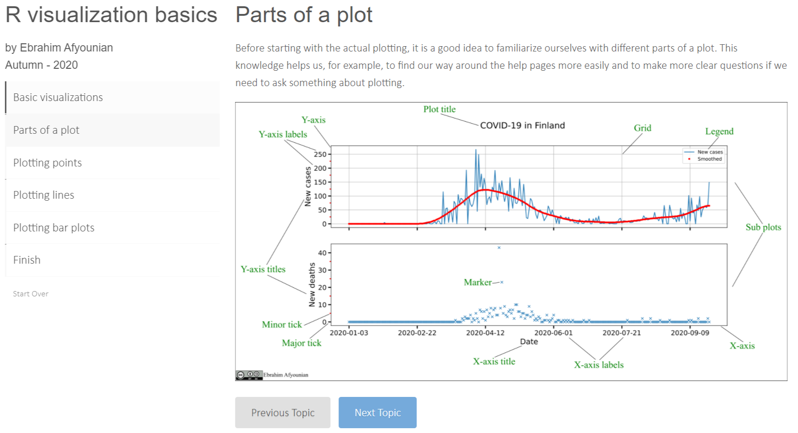
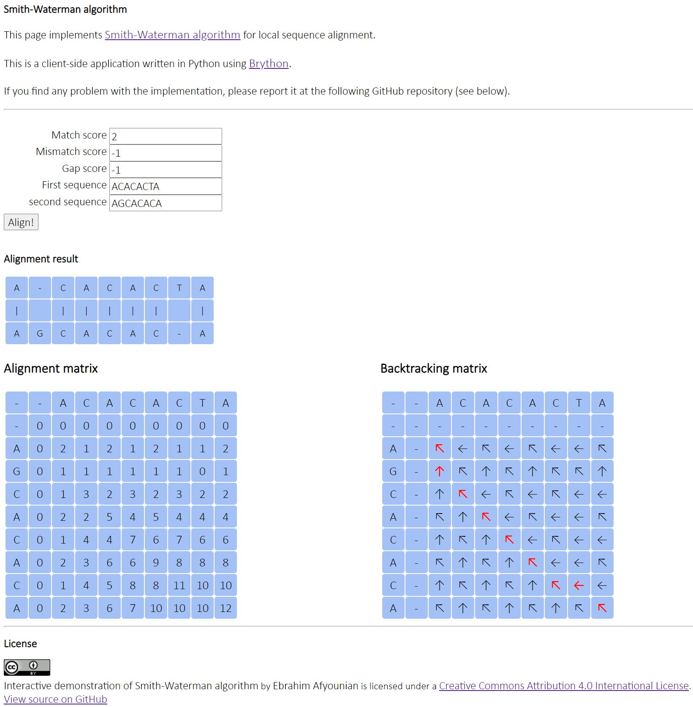

layout: true

    

---
.centre[

# &#x2660; Digital pedagogy pilot project &#x2660;

## digi-pilot / digipilotti

### Ebrahim Afyounian  

#### Tampere - 28-09-2020

## &#x1F342;

]
---

## Bioinformatics Digi-pilot

- Bioinformatics digi-pilot (started on March 2020)
- Head of the project:
  - Juha K.  (MET)
  - Anne K. (MET)
- Kaisa L. (March-September 2020)
- Ebrahim A. (July-December 2020)

---

## Aims and focus

### Aims

- Enabling **distant learning** for working-life students
- Providing different types of **pedagogically-informed teaching materials**
- Making the **schedule** more **flexible** for the students
- Providing **immediate feedback** for both students and teachers

### Focus is on 3 master's level courses* (each 5 ECTS)

- **BTK6002**: Introduction to high-throughput data analysis [period **I**]
- **BTK6003**: Biological data analysis [period **II**]
- **BTK6004**: High-throughput sequencing data analysis [periods **III** and **IV**]

\* **Master's** Degree Programme in **Biomedical Technology**

---

## Materials (1)

- &#x2753; **Pre-lecture** *Moodle* quiz
- &#x1F393; "Traditional" lectures delivered via **Zoom** video conferencing tool, recorded and available via **Panopto**
- &#x2753; **Post-lecture** *Moodle* quizzes (at least 1 set)
- Weekly **exercise sets** with due date &#x231A; 
- &#x1F4FA; **Animations** and **screen capture** videos
- &#x1F36D; ***learnr*** interactive tutorials
- &#x1F477; Online tool(s) e.g. **Smith-Waterman demo**

---

## Materials (2)

### Animations and screen capture videos

- In-house (so far **5 animations**, **2+2 screen captures**)
  - **Sequencing**, **IGV**, **WinSCP**, **Standard streams**, **Binary system**, **hierarchical clustering**, **enrichment analysis**, and **survival analysis**
- Other online resources (e.g. [MIT computational Biology course](https://www.youtube.com/playlist?list=PLypiXJdtIca6GBQwDTo4bIEDV8F4RcAgt) and [StatQuest with Josh Starmer](https://www.youtube.com/playlist?list=PLblh5JKOoLUJo2Q6xK4tZElbIvAACEykp))

.center[

]

---

## Materials (3)

### *learnr* interactive tutorials

- Contains quizzes and code completion
- So far 2: **R data type basics** and **R visualization basics**

.center[

]

---

## Materials (4)

### Online tool(s) &#x1F477;
.center[

]
---

## Materials (5)

### Flipped classroom (1)

- We have used some **elements** of flipped classroom methodology in the **BTK6002** course
- Going to use this in **BTK6003** as well.

.center[

]

---

## Materials (5)

### Flipped classroom (2) / Development area &#x1F477;

- Exercise was expected to be viewed and completed before **08.09.2020** - 10 a.m.
  - Only **15 students** have watched the video (data accessed on 23.09.2020-13:00)
  - **All** have viewed the lecture slides.
- According to [Compeau (2019)](https://journals.plos.org/ploscompbiol/article?id=10.1371/journal.pcbi.1006764), the flipped classroom method and its benefits of using it should be discussed with students beforehand for an implementation to be successful.  
.center[

]

---

## Preliminary results / Success &#x1F389;

- &#x1F4C9; **students** are spending less time doing the exercises (compared to last year's implementation)
- &#x1F4C9; Less time spent in grading
- Students are completing more of the assignments
- &#x1F4C8; Some improvements in **students performance** are already visible
- One student attending from abroad without difficulty

.table.table-bordered.table-striped.table-hover.smaller-font[
| Week | Ex1 | Ex2 | Ex3 | Ex4 | Ex5 | Ex6 | Average (2020) | Average (2019) |
|---| -- | -- |-- |-- |-- |-- | -- | -- |
| W1 |  0.99 (25)|0.98 (24)|0.95 (25)|0.90 (23)|0.70 (23) |0.82 (22)| 0.89 | 0.89 |
| W2 |0.98 (25)|0.96(25)|0.99 (24) | 0.84 (24)| 0.96 (24)| NA | 0.95 | 0.9 |
| W3 |0.96 (25) |0.94 (25) |0.92 (25) |0.86 (24)|0.8 (24)| 0.8 (24) | 0.88 | 0.89 |
| W4 |0.95 (25) |0.95 (25) |0.95 (25) |0.82 (25)|0.85 (25)| 0.79 (25) | 0.89 | 0.76 |
]

---

## Next steps

- In October 2020, the focus will be mainly on the **BTK6003** course
  - Updating/Improving exercises sets
  - Transforming the exercises into Moodle quiz format
  - Developing more *learnr* tutorials
  - Experimenting with [CodeRunner](https://coderunner.org.nz/) for automatic grading of student R scripts
- In December 2020, planning and implementation of **BTK6004** course starts
  - Using lessons learned from the **BTK6002** and **BTK76003** courses

---

.centre[

# Thank you for your attention!

# &#x1F49B; &#x1F339; &#x1F342; &#x1F49A;

## &#x2753; &#x270B; **Questions!**

 

If you got interested, there is a **longer version** of this talk available [here](https://cicero.xyz/v3/remark/0.14.0/github.com/eafyounian/presentations/no_photo_table/28092020_digipilot.md/#1)

]
